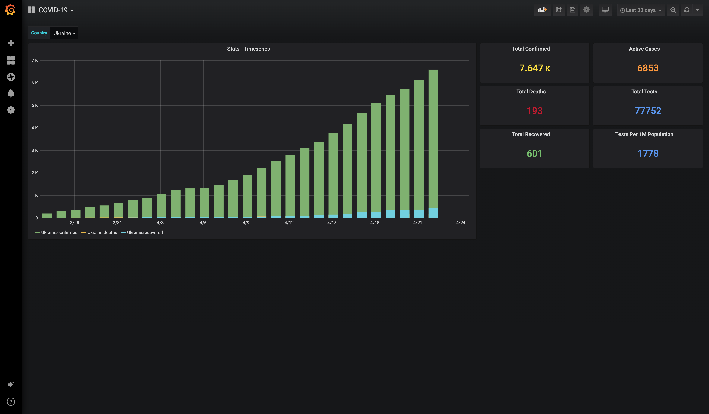

# covid19-grafana-ukraine
Yet another one pet-project which consumes public API's to gather
and display information in Grafana about COVID-19 situation in all the countries. 
 

Data:  
* [CSSEGISandData](https://github.com/CSSEGISandData/COVID-19)  
  
API's:  
* [pomber's translation of data to json](https://github.com/pomber/covid19)  
* [twei55's API for Grafana & JSON Datasource](https://covid19-grafana.herokuapp.com/) [(repo)](https://github.com/twei55/covid19-grafana-datasource)  
* [ChrisMichael's API](https://github.com/ChrisMichaelPerezSantiago/covid19)  

# Run
1. Clone this project
2. Run `docker-compose up -d`
3. Open http://localhost in your browser  

# TODO
Predictions?  
Deathrate?  
Maps?  